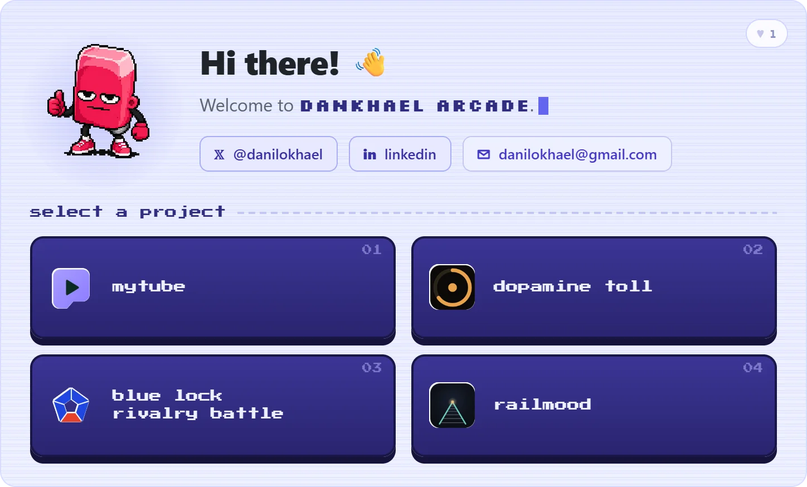

<div align="center">

<!-- ░▒▓ ANIMATED ARCADE CARD — click to open the live, interactive version ▓▒░ -->
<a href="https://dankhael.github.io/dankhael/card/" title="Open the live interactive arcade">
  
</a>

</div>

---

## `> SYSTEM/whoami.exe`

```yaml
operator:    Danilo Mikhael da Silva Melo
alias:       dankhael
location:    Recife, Pernambuco, BR
status:      Bacharelando em BSI @ UFRPE
focus:       Fullstack Dev • Bot Engineering • Browser Extensions
mood:        retrogaming + coca-cola + sports
```

---

## `> PROCESSES/running.log`

```
PID    PROCESS                            CPU%   STATUS
────────────────────────────────────────────────────────────────────
0001   fuuka-cata-link                    85%    [RUNNING 24/7]
0002   DopamineToll                       45%    [PUBLISHED]
0003   mytube                             60%    [DEVELOPING]
0004   RailMood                           20%    [DEPLOYED]
0005   rivalryBattleSimulator             30%    [STABLE]
0006   dank-fyi                           10%    [LISTENING]
```

---

## `> STATS/system.dat`

<div align="center">

<a href="https://github.com/dankhael">
  
  
</a>

<br/>

<a href="https://github.com/dankhael">
  
</a>

<br/>

<a href="https://github.com/dankhael">
  
</a>

</div>

---

## `> NETWORK/connect.cfg`

<div align="center">

[](https://github.com/dankhael)
[](mailto:danilokhael@gmail.com)

</div>

---
